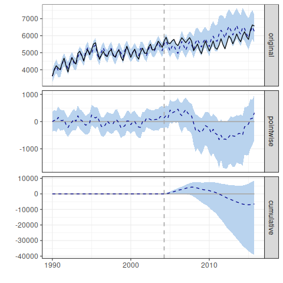

<!-- README.md is generated from README.Rmd. Please edit that file -->
A Bayesian Approach to the Minimum Wage
---------------------------------------

This is the github repository for exploratory work on the minimum wage that may develop into a paper. The idea is to consider two possibilities:

1.  Whether using a bayesian/machine learning model to predict a counterfactual contributes anything of interest.

2.  Whether a matching algorithm and bayesian statistical approach yields any new insights.

Santa Fe increased it's minimum wage from $5.15 to $8.50 in June 2004. Using a very basic model to predict the counterfactual and ignoring the subsequent minimum wage increases, the effect is rather startling:

For now, please cite this repository as:

> Potter, Nicholas. "Bayesian Inference: Insights into the Impacts of Minimum Wage Policies". Working Paper. 2017. Available: <http://www.github.com/potterzot/paper-bayesian-minwage>.

Requirements
------------

Specific R packages needed to run code in this repository include:

-   RCurl
-   data.table
-   [assertthat](https://github.com/hadley/assertthat)
-   [CausalImpact](https://github.com/google/CausalImpact)

To install all needed packages, you can copy and paste this code into RStudio:

    install.packages(c("RCurl", "data.table"))
    devtools::install_github("hadley/assertthat")
    devtools::install_github("google/CausalImpact")

How to use this repository
--------------------------

There are a few different ways you may want to use this repository:

1.  To reproduce or examine work and results from the paper.
2.  As a base to expand on the research contained herein. If so you may want to just fork the repository and continue on. Contributions to this repository are also welcome! Please follow the contribution guidelines (not yet written) and submit a pull request when ready.
3.  As a framework for a [reproducible research](http://kbroman.org/Tools4RR/) project. In that case a better alternative might be my [research-template](github.com/potterzot/research-template), which provides a skeleton with some thoughts about the best use. There are several other (and probably better) attempts at this, including [rrrpkg](https://github.com/ropensci/rrrpkg), [projecttemplate](http://projecttemplate.net/), and [cboettig's template](https://github.com/cboettig/template).
4.  Use it to access the data used in the project. This is best done by cloning the repository and typing `make data_all` in the repository directory.
